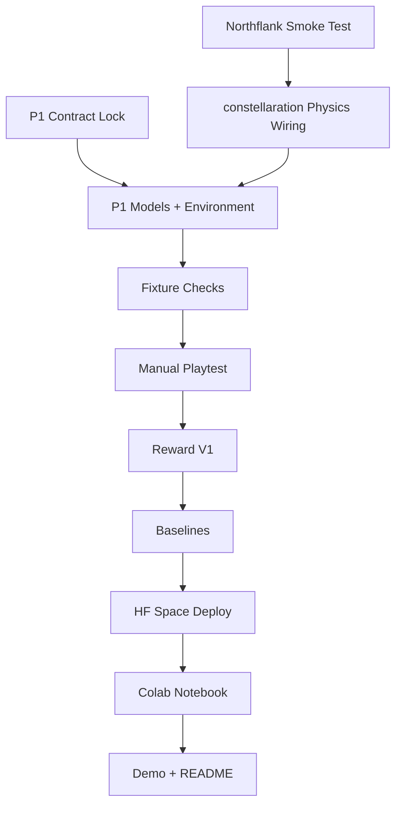

# Fusion Design Lab TODO

This is the execution tracker for the hackathon repo.

Use this file for day-of build progress. Use the linked docs for rationale, sequencing, and submission framing:

- [Plan V2](/Users/suhjungdae/code/fusion-design-lab/docs/FUSION_DESIGN_LAB_PLAN_V2.md)
- [Deliverables Map](/Users/suhjungdae/code/fusion-design-lab/docs/FUSION_DELIVERABLES_MAP.md)
- [Next 12 Hours Checklist](/Users/suhjungdae/code/fusion-design-lab/docs/FUSION_NEXT_12_HOURS_CHECKLIST.md)
- [P1 Pivot Record](/Users/suhjungdae/code/fusion-design-lab/docs/PIVOT_P1_ROTATING_ELLIPSE.md)
- [Repo Guardrails](/Users/suhjungdae/code/fusion-design-lab/AGENTS.md)

Priority source:

- [Plan V2](/Users/suhjungdae/code/fusion-design-lab/docs/FUSION_DESIGN_LAB_PLAN_V2.md) is the planning SSOT
- [Next 12 Hours Checklist](/Users/suhjungdae/code/fusion-design-lab/docs/FUSION_NEXT_12_HOURS_CHECKLIST.md) is the execution order SSOT
- this file should track execution progress only

## Execution Graph

## Hour 0-2

- [ ] Lock the exact `P1` environment contract
  Goal:
  freeze observation schema, action schema, episode loop, terminal conditions, and `Reward V0`
  Related:
  [Plan V2](/Users/suhjungdae/code/fusion-design-lab/docs/FUSION_DESIGN_LAB_PLAN_V2.md),
  [Next 12 Hours Checklist](/Users/suhjungdae/code/fusion-design-lab/docs/FUSION_NEXT_12_HOURS_CHECKLIST.md)

- [ ] Pass the Northflank smoke test
  Related:
  [Plan V2](/Users/suhjungdae/code/fusion-design-lab/docs/FUSION_DESIGN_LAB_PLAN_V2.md),
  [Next 12 Hours Checklist](/Users/suhjungdae/code/fusion-design-lab/docs/FUSION_NEXT_12_HOURS_CHECKLIST.md),
  [training/notebooks/README.md](/Users/suhjungdae/code/fusion-design-lab/training/notebooks/README.md)

## Fresh Wiring

- [ ] Rewrite the shared models to the locked `P1` contract
  Files:
  [fusion_lab/models.py](/Users/suhjungdae/code/fusion-design-lab/fusion_lab/models.py),
  [Plan V2](/Users/suhjungdae/code/fusion-design-lab/docs/FUSION_DESIGN_LAB_PLAN_V2.md)

- [ ] Rewrite the environment loop to the locked `P1` contract
  Files:
  [server/environment.py](/Users/suhjungdae/code/fusion-design-lab/server/environment.py),
  [Plan V2](/Users/suhjungdae/code/fusion-design-lab/docs/FUSION_DESIGN_LAB_PLAN_V2.md),
  [P1 Pivot Record](/Users/suhjungdae/code/fusion-design-lab/docs/PIVOT_P1_ROTATING_ELLIPSE.md)

- [ ] Replace the toy physics path with `constellaration` wiring
  Files:
  [server/physics.py](/Users/suhjungdae/code/fusion-design-lab/server/physics.py),
  [server/Dockerfile](/Users/suhjungdae/code/fusion-design-lab/server/Dockerfile),
  [pyproject.toml](/Users/suhjungdae/code/fusion-design-lab/pyproject.toml)

- [ ] Update the API/task surface to match `P1`
  Files:
  [server/app.py](/Users/suhjungdae/code/fusion-design-lab/server/app.py),
  [README.md](/Users/suhjungdae/code/fusion-design-lab/README.md)

## Validation and Reward

- [ ] Add 1-2 tracked `P1` fixtures
  Files:
  [server/data/p1/README.md](/Users/suhjungdae/code/fusion-design-lab/server/data/p1/README.md),
  [P1 Pivot Record](/Users/suhjungdae/code/fusion-design-lab/docs/PIVOT_P1_ROTATING_ELLIPSE.md)

- [ ] Run fixture sanity checks
  Goal:
  confirm verifier outputs, objective direction, and reward ordering
  Related:
  [Plan V2](/Users/suhjungdae/code/fusion-design-lab/docs/FUSION_DESIGN_LAB_PLAN_V2.md),
  [Next 12 Hours Checklist](/Users/suhjungdae/code/fusion-design-lab/docs/FUSION_NEXT_12_HOURS_CHECKLIST.md)

- [ ] Manual-playtest 5-10 episodes
  Goal:
  verify a human can act coherently and surface at least one pathology or ambiguity
  Related:
  [Plan V2](/Users/suhjungdae/code/fusion-design-lab/docs/FUSION_DESIGN_LAB_PLAN_V2.md),
  [Deliverables Map](/Users/suhjungdae/code/fusion-design-lab/docs/FUSION_DELIVERABLES_MAP.md)

- [ ] Update reward from `V0` to `V1` if playtesting reveals a real pathology
  Goal:
  keep a short exploit -> fix -> behavior improvement story
  Related:
  [AGENTS.md](/Users/suhjungdae/code/fusion-design-lab/AGENTS.md),
  [Plan V2](/Users/suhjungdae/code/fusion-design-lab/docs/FUSION_DESIGN_LAB_PLAN_V2.md)

## Baselines

- [ ] Implement and run the random baseline
  Files:
  [baselines/random_agent.py](/Users/suhjungdae/code/fusion-design-lab/baselines/random_agent.py),
  [baselines/compare.py](/Users/suhjungdae/code/fusion-design-lab/baselines/compare.py)

- [ ] Implement and run the heuristic baseline
  Files:
  [baselines/heuristic_agent.py](/Users/suhjungdae/code/fusion-design-lab/baselines/heuristic_agent.py),
  [baselines/compare.py](/Users/suhjungdae/code/fusion-design-lab/baselines/compare.py)

- [ ] Save one comparison trace that is presentation-ready
  Goal:
  show at least one stable trajectory and one heuristic-vs-random comparison

## Submission Surfaces

- [ ] Deploy the environment to HF Space
  Related:
  [Deliverables Map](/Users/suhjungdae/code/fusion-design-lab/docs/FUSION_DELIVERABLES_MAP.md),
  [README.md](/Users/suhjungdae/code/fusion-design-lab/README.md)

- [ ] Create the thin public Colab notebook
  Files:
  [training/notebooks/README.md](/Users/suhjungdae/code/fusion-design-lab/training/notebooks/README.md)

- [ ] Record the 1-minute demo
  Goal:
  explain `P1`, show one trajectory, show reward iteration, show baseline evidence

- [ ] Finalize the public README
  Files:
  [README.md](/Users/suhjungdae/code/fusion-design-lab/README.md)

- [ ] Only add training evidence if it is actually persuasive
  Related:
  [Plan V2](/Users/suhjungdae/code/fusion-design-lab/docs/FUSION_DESIGN_LAB_PLAN_V2.md),
  [Next 12 Hours Checklist](/Users/suhjungdae/code/fusion-design-lab/docs/FUSION_NEXT_12_HOURS_CHECKLIST.md)

## Guardrails

- [ ] Do not reopen `P1 + rotating-ellipse` strategy without a real blocker
- [ ] Do not port the old `ai-sci-feasible-designs` harness
- [ ] Do not let notebook or demo work outrun environment evidence
- [ ] Do not add training-first complexity before manual playtesting
