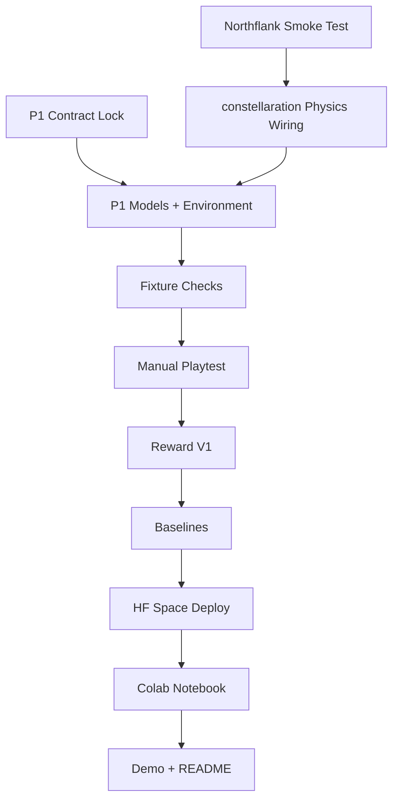

# Fusion Design Lab TODO

This is the execution tracker for the hackathon repo.

Use this file for day-of build progress. Use the linked docs for rationale, sequencing, and submission framing:

- [Plan V2](docs/FUSION_DESIGN_LAB_PLAN_V2.md)
- [Deliverables Map](docs/FUSION_DELIVERABLES_MAP.md)
- [Next 12 Hours Checklist](docs/FUSION_NEXT_12_HOURS_CHECKLIST.md)
- [P1 Pivot Record](docs/PIVOT_P1_ROTATING_ELLIPSE.md)
- [Repo Guardrails](AGENTS.md)

Priority source:

- [Plan V2](docs/FUSION_DESIGN_LAB_PLAN_V2.md) is the planning SSOT
- [Next 12 Hours Checklist](docs/FUSION_NEXT_12_HOURS_CHECKLIST.md) is the execution order SSOT
- this file should track execution progress only

## Current State

- [x] `P1` strategy is locked
- [x] shared models reflect the rotating-ellipse `P1` contract
- [x] environment loop reflects the rotating-ellipse `P1` contract
- [x] API/task surface reflects `P1`
- [x] baselines reflect the `P1` contract
- [x] repo docs call out the synthetic evaluator honestly
- [x] post-terminal guard in `step()`
- [ ] `constellaration` verifier wiring
- [ ] tracked `P1` fixtures
- [ ] manual playtest log
- [x] settle the non-submit terminal reward policy
- [x] baseline comparison has been run once on the current synthetic `P1` branch state

## Execution Graph

## Hour 0-2

- [x] Lock the exact `P1` environment contract
  Goal:
  freeze observation schema, action schema, episode loop, terminal conditions, and `Reward V0`
  Related:
  [Plan V2](docs/FUSION_DESIGN_LAB_PLAN_V2.md),
  [Next 12 Hours Checklist](docs/FUSION_NEXT_12_HOURS_CHECKLIST.md)

- [ ] Pass the Northflank smoke test
  Related:
  [Plan V2](docs/FUSION_DESIGN_LAB_PLAN_V2.md),
  [Next 12 Hours Checklist](docs/FUSION_NEXT_12_HOURS_CHECKLIST.md),
  [training/notebooks/README.md](training/notebooks/README.md)

## Fresh Wiring

- [x] Rewrite the shared models to the locked `P1` contract
  Files:
  [fusion_lab/models.py](fusion_lab/models.py),
  [Plan V2](docs/FUSION_DESIGN_LAB_PLAN_V2.md)

- [x] Rewrite the environment loop to the locked `P1` contract
  Files:
  [server/environment.py](server/environment.py),
  [Plan V2](docs/FUSION_DESIGN_LAB_PLAN_V2.md),
  [P1 Pivot Record](docs/PIVOT_P1_ROTATING_ELLIPSE.md)

- [x] Add a post-terminal guard to the environment loop
  Files:
  [server/environment.py](server/environment.py)
  Goal:
  reject or no-op any `step()` call after terminal state so budget and step count do not drift past episode end

- [ ] Replace the synthetic physics path with `constellaration` wiring
  Files:
  [server/physics.py](server/physics.py),
  [server/Dockerfile](server/Dockerfile),
  [pyproject.toml](pyproject.toml)

- [x] Update the API/task surface to match `P1`
  Files:
  [server/app.py](server/app.py),
  [README.md](README.md)

## Validation and Reward

- [ ] Add 1-2 tracked `P1` fixtures
  Files:
  [server/data/p1/README.md](server/data/p1/README.md),
  [P1 Pivot Record](docs/PIVOT_P1_ROTATING_ELLIPSE.md)

- [ ] Run fixture sanity checks
  Goal:
  confirm verifier outputs, objective direction, and reward ordering
  Related:
  [Plan V2](docs/FUSION_DESIGN_LAB_PLAN_V2.md),
  [Next 12 Hours Checklist](docs/FUSION_NEXT_12_HOURS_CHECKLIST.md)

- [ ] Manual-playtest 5-10 episodes
  Goal:
  verify a human can act coherently and surface at least one pathology or ambiguity
  Related:
  [Plan V2](docs/FUSION_DESIGN_LAB_PLAN_V2.md),
  [Deliverables Map](docs/FUSION_DELIVERABLES_MAP.md)

- [ ] Update reward from `V0` to `V1` if playtesting reveals a real pathology
  Goal:
  keep a short exploit -> fix -> behavior improvement story
  Related:
  [AGENTS.md](AGENTS.md),
  [Plan V2](docs/FUSION_DESIGN_LAB_PLAN_V2.md)

- [x] Decide the non-submit terminal reward policy
  Goal:
  budget exhaustion now yields a smaller end-of-episode reward than `submit`, so non-submitting agents still get terminal feedback without outranking explicit submit behavior
  Files:
  [server/environment.py](server/environment.py),
  [README.md](README.md)

## Baselines

- [x] Implement the random baseline
  Files:
  [baselines/random_agent.py](baselines/random_agent.py),
  [baselines/compare.py](baselines/compare.py)

- [x] Implement the heuristic baseline
  Files:
  [baselines/heuristic_agent.py](baselines/heuristic_agent.py),
  [baselines/compare.py](baselines/compare.py)

- [x] Run the baseline comparison on the current `P1` branch state
  Files:
  [baselines/compare.py](baselines/compare.py)

- [ ] Save one comparison trace that is presentation-ready
  Goal:
  show at least one stable trajectory and one heuristic-vs-random comparison

## Submission Surfaces

- [ ] Deploy the environment to HF Space
  Related:
  [Deliverables Map](docs/FUSION_DELIVERABLES_MAP.md),
  [README.md](README.md)

- [ ] Create the thin public Colab notebook
  Files:
  [training/notebooks/README.md](training/notebooks/README.md)

- [ ] Record the 1-minute demo
  Goal:
  explain `P1`, show one trajectory, show reward iteration, show baseline evidence

- [ ] Finalize the public README
  Files:
  [README.md](README.md)

- [ ] Only add training evidence if it is actually persuasive
  Related:
  [Plan V2](docs/FUSION_DESIGN_LAB_PLAN_V2.md),
  [Next 12 Hours Checklist](docs/FUSION_NEXT_12_HOURS_CHECKLIST.md)

## Guardrails

- [ ] Do not reopen `P1 + rotating-ellipse` strategy without a real blocker
- [ ] Do not port the old `ai-sci-feasible-designs` harness
- [ ] Do not let notebook or demo work outrun environment evidence
- [ ] Do not add training-first complexity before manual playtesting
- [ ] Do not describe the current synthetic evaluator as the official verifier integration
- [ ] Do not describe the current baseline reset state as already feasible
