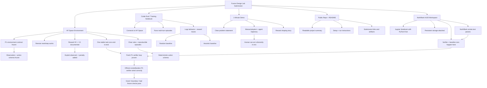
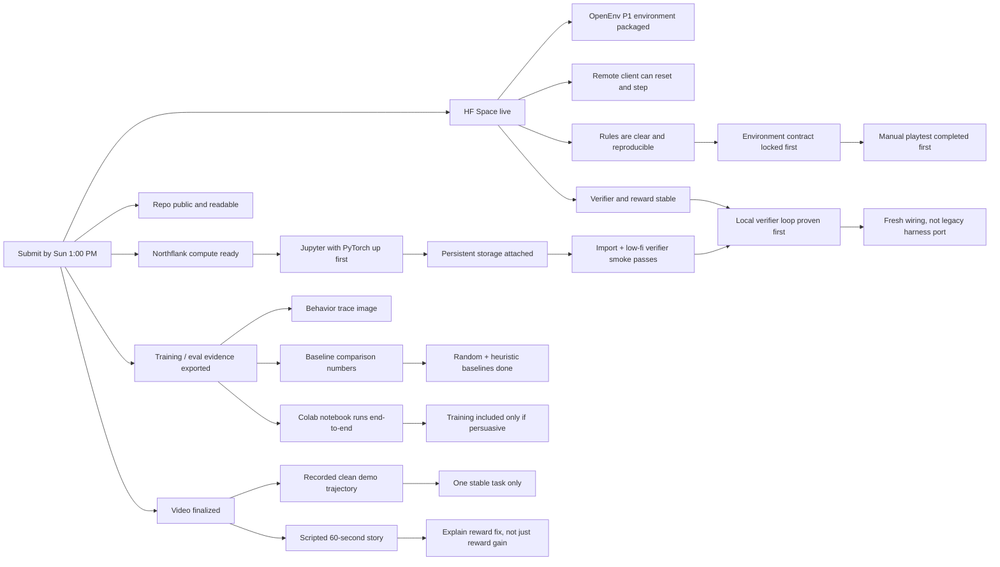

# Fusion Design Lab Deliverables Map

This is the output-first map for the hackathon. It is aligned to Plan V2: `P1` is locked, the environment is built fresh in this repo, the old harness is not ported, and training claims stay conservative. Everything branches from the four final artifacts the judges and submission flow will actually see.

Northflank is the recommended compute workspace behind those artifacts. HF Space and Colab remain the actual submission surfaces.

Use this map to sequence execution, not to reopen already-locked task choices.

## Current Branch Status

- [x] `P1` contract is frozen in code
- [x] official `constellaration` verifier loop is wired
- [x] baseline comparison has been rerun on the real verifier path
- [x] Northflank smoke workflow and note are committed
- [ ] tracked fixtures are checked in
- [ ] manual playtest evidence exists
- [ ] heuristic baseline has been refreshed for the real verifier path
- [ ] HF Space deployment is live

## Deliverables Tree

## Reverse Timeline

## Priority Order

1. Add tracked fixtures and run fixture sanity checks.
2. Manual-playtest the environment and record the first real pathology, if any.
3. Refresh the heuristic baseline from that evidence.
4. Bring up the Northflank H100 workspace with persistent storage.
5. Pass the Northflank smoke test.
6. Make one stable OpenEnv `P1` task work remotely with clear, reproducible rules.
7. Use the notebook to show traces and comparisons; include training only if it adds signal.
8. Record the demo around environment clarity, verifier fidelity, reward shaping, and one stable trajectory.
9. Polish the repo only after the artifacts are real.
