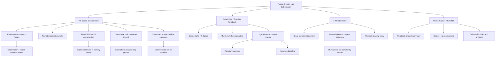
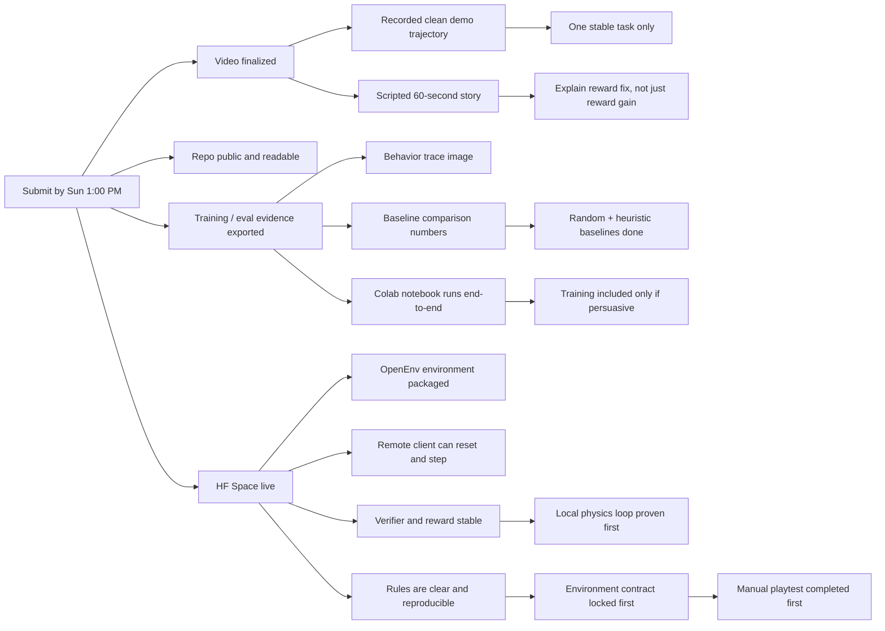

# Fusion Design Lab Deliverables Map

This is the output-first map for the hackathon. It is aligned to Plan V2: environment-first, reward-iteration-driven, and conservative about training claims. Everything branches from the four final artifacts the judges and submission flow will actually see.

## Deliverables Tree

## Reverse Timeline

## Priority Order

1. Prove the local physics loop.
2. Freeze the environment contract and mark the initial reward as `V0`.
3. Manual-playtest the environment and fix obvious reward/pathology issues.
4. Make one stable OpenEnv task work remotely with clear, reproducible rules.
5. Get random and heuristic baselines.
6. Use the notebook to show traces and comparisons; include training only if it adds signal.
7. Record the demo around environment clarity, reward shaping, and one stable trajectory.
8. Polish the repo only after the artifacts are real.
